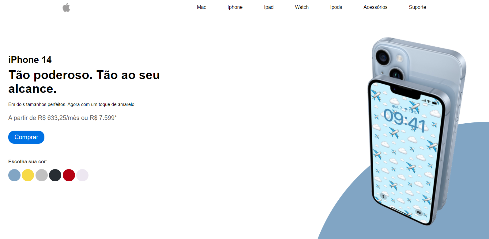

# Página estática simulando uma página de venda de um Iphone 
1
### Screenshot

## Para baixar o projeto faça o seguinte:

** Clique no botão verde CODE e copie o link do repositório e faça um git clone ou clique em Download zip.

## Para rodar o projeto faça o seguinte:

** Depois de baixado como zip ou clonado abra a pasta que voce baixou e vá para o arquivo index.html e  abra ele no seu navegador.
************************************

## To download the project do the following:

** Click the green CODE button and copy the repository link and do a git clone or click Download zip.

## To run the project do the following:

** Once downloaded as a zip or cloned open the folder you downloaded and go to the index.html file and open it in your browser.